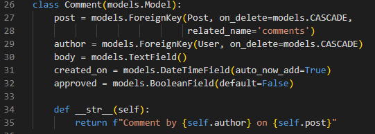
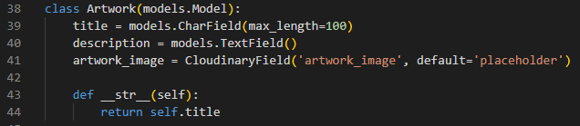
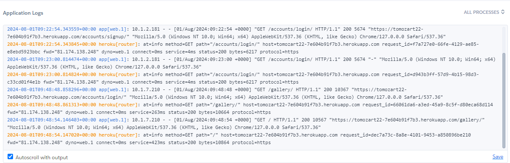

# Tomozart Art Gallery Web Site

## Introduction:
Welcome to Tomo's Art Gallery, the official online art space of Thomas A Overment, also known as Tomo. This web page showcases a vibrant collection of my artwork, ranging from dynamic spray paintings to intricate mixed media canvas works. Whether you're an art enthusiast or simply curious, this gallery offers a window into the creative world of Tomo.

## Overview:
Tomozart Gallery is a personal project designed to provide an accessible platform for viewing, sharing, and appreciating the diverse artistic creations. Visitors can explore a variety of artworks, learn more about the artist, and stay updated with the latest additions to the collection.

View live site here : https://tomozart22-7e604b91f7b3.herokuapp.com/
Github Repo: https://github.com/TomOverment/tomozart22
Kanban Board: https://github.com/users/TomOverment/projects/6

## Features:
The project includes features for user registration, sign-in, and sign-out, along with the ability to upload and manage posts. Additionally, there is a gallery page showcasing various artworks and a main blog page where users can engage and interact with the content.

### View Art on the Gallery Page: 
Admins upload images and descriptions via the Django admin panel. The gallery is automatically organized with Bootstrap and is responsive to different screen sizes.

### Add a Post: 
Users can create posts with an optional image through the add post page. These posts can be viewed on the home page, edited on the edit post page, and deleted if necessary.

### Profiles: 
Users can view their draft and published posts on their profile page, where links to edit or delete these posts are provided.

### Register: 
Users can register to gain the ability to add posts and, in the future, join an optional mailing list.

## Receive Notifications: 
Users are informed about the success or failure of their actions and their login status.

### The Blog: 
Users can view all posts but can only edit or delete their own posts.

Tomozart Gallery is accessible through all browsers and is fully responsive to different screen sizes. It meets the minimum viable product (MVP) requirements, providing a solid foundation to build upon and engage with an audience effectively.

# UX - User Experience

## Design Inspiration
The inspiration for this product comes from my experience in the art industry. It is something I have wanted to do but not been able untill this piont. I look forward too furthur developing my skills to add features to this and new projects.

The colour scheme is predominantly greyscale as neutural colours won't clash with any artwork uploaded. The header and footer are black, similar to standard black frames for artwork, because it draws attension. The background features a near-white gradient, dark at the top and light at the bottom, emulating a blue sky and resembling an artist's mount, which draws attention to the artwork. Green is used throughout as it is a productive color, symbolizing progress and action, akin to "go."

The logo features the initials of my name in green, consistent with the color scheme used throughout the site. I plan to update this logo in the future using Adobe Illustrator instead of the current version created with logo.com for time-saving purposes.

The intention behind this color scheme is to create a visually cohesive and unobtrusive environment that highlights the artwork. By using neutral and green tones, the design ensures that the viewer's attention is directed towards the art pieces themselves, enhancing their viewing experience without distractions. This thoughtful use of colors not only complements the artwork but also reinforces the gallery's aesthetic appeal and functionality.

# Colours

- **8abe53 - Pistachio:**
- **000000 - White:**
- **000000 - Black:**
- **Fe9ecef - Anti-flash White:**
- **9fa6b2 - Cadet Grey:**
- **9188181 - Teal:**
- **acafaf - Silver:**
- **4a4a4f - Davey's Grey:**
- **e84610 - Golden Gate Bridge:**
     
## Font
I used the Lato font, imported from Google Fonts, to maintain a clean and unobtrusive look. This choice ensures that the font does not distract from the content, allowing the artwork and other elements to take center stage.

## Site Layout
Here is a flowchart outling the layout of my project.
All the most important links are in the navbar and accessable at all times and the social links are in the fotter. (Social links don't point directly to my accounts because i'm making new ones for artistic purposes)

# Project Planning

## Epics

Epic: User Engagement and Content Management System

Description: This epic encompasses a range of features aimed at enhancing user interaction and content creation on the website. The primary focus is on facilitating seamless communication between users and the artist, enabling content contributions through posts and comments, showcasing the artist's work, and maintaining a blog for updates and events. The overarching goal is to create a user-friendly and interactive platform that encourages engagement and allows for efficient content management.

Objectives: The key objectives include providing users with a means to connect with the artist through social media links, enabling user registration for access to exclusive site features, and supporting user-generated content through posts and comments. Additionally, the epic aims to offer a comprehensive profile management system where users can view and manage their interactions, establish a gallery for showcasing the artist's work, and implement a blog for regular updates and communication with the audience.

User Stories: The epic breaks down in to several user stories that describe specific functionalities. Firstly, users should be able to use social media links to communicate with the artist, ensuring these links are included in the footer and displayed consistently across all pages. Secondly, user registration is crucial, allowing users to sign up and receive confirmation emails, with proper error handling for invalid inputs. Thirdly, the functionality to add posts should be straightforward, enabling users to contribute content by uploading images and adding comments, with all posts visible on the blog.

In terms of profile management, users should have the ability to see their own posts, categorized into drafts and published, and be able to update or delete these posts from their profile page. For the gallery, the artist should be able to upload artwork along with descriptions and titles, with each piece viewable individually. Lastly, the blog functionality should include comprehensive CRUD capabilities, with time and date stamps on posts and support for posting images and comments.

Acceptance Criteria: The acceptance criteria for this epic include the proper implementation and functionality of social media links, user registration with email confirmation and error handling, and an intuitive post-creation interface. The profile system should accurately reflect users' posts and allow for easy management. The gallery should enable the artist to showcase artwork effectively, and the blog must support full CRUD operations with clear timestamps and multimedia content options.

Dependencies: Key dependencies include social media integration, an email service for sending registration confirmations, and a robust content management system (CMS) to support the posts, profile, gallery, and blog functionalities.

Timeline: The timeline for this epic is structured over two weeks. The first week focuses on implementing social media links and user registration features, development shifts to the "Add Post" functionality and profile management systems. The second week is dedicated to creating the gallery feature, setting up the artist's admin panel and finally completing the blog functionality and conducting thorough testing across the entire system to ensure all components work seamlessly together.

## Strategy

The Tomozart project was approached using a blend of Agile methodology, user stories, and Kanban to ensure a flexible, user-focused, and efficient development process. This strategy allowed me to prioritize user needs, adapt to changes quickly, and maintain a steady workflow.

- Defining the Vision and Goals
The first step in the strategy was to establish a clear vision and set of goals for the Tomozart project. The vision focused on creating an online art gallery that showcases vibrant and diverse artwork while providing an intuitive and engaging user experience. Key goals included:

Showcase artwork in a visually appealing manner.
Enable users to interact with the content by adding posts with comments and images.
Ensure accessibility across all devices and browsers.
Implement a user-friendly and aesthetically pleasing design.

- User Stories Development
User stories were created to capture the functionalities and features from the perspective of the end users. Each user story was written in a simple format: "As a [user role], I want [feature or action] so that [reason or benefit]." This approach ensured that all features aligned with user needs and provided clear, actionable items for the development team.

## User Stories:
- Contacting the Artist: As a user, I want to use social media links to ask questions or request commissions, so that I can communicate directly with the artist.
Success Criteria:
Criterion 1: Include social media in the footer.
Criterion 2: Have a template that shows social media links on every page.

- Registration: As a user I want to sign up and register, so that I can use exclusive site features.
Success Criteria:
Criterion 1: User registration.
Criterion 2: The user should receive a confirmation email upon registration.
Criterion 3: Display error messages for invalid inputs.

- Add posts: As a user I want to easily add posts to the blog, so that I can leave interact.
Success Criteria:
Criterion 1: Add post page.
Criterion 2: Upload images as well as comment.
Criterion 3: See the uploaded posts.

- Profile: As a user, I want to , be able to register and see my posts, so that I can easily find my interaction.
Success Criteria:
Criterion 1: Have draft and published posts
Criterion 2: Only see users own posts on the profile page.
Criterion 3: Easily update or delete posts from profile page.

- Gallery: As a owner, I want to upload artwork, so that visitors can easily browse the portfolio.
Success Criteria
Criterion 1: be able to add descriptions and titles to my artwork
Criterion 2: View art individually.
Criterion 3: Easily upload from the admin panel.

- Blog: As a user I want to post updates and blog articles about work and events, so that I can keep the website updated.
Success Criteria
Criterion 1: The blog must have crud functionality.
Criterion 2: Time and date of posts.
Criterion 3: Post images as well as comments.

## Kanban Board

Kanban Board: https://github.com/users/TomOverment/projects/6

A Kanban board was set up to map out and manage the development process visually. The board was organized into columns that depicted various stages of the workflow: To Do, In Progress, and Done. Each user story transitioned through these columns as work progressed.

Kanban Workflow:

To Do: Tasks selected as priorities for the current iteration were added to the "To Do" column, indicating they were ready to be worked on.

In Progress: Tasks currently under development were moved to this column, indicating active work.

Done: After being completed tasks were placed in the "Done" column, marking their finalization.

## Agile Practices:

Agile methodology was adopted to encourage adaptability and ongoing enhancement. The project was broken down into brief iterations, with each cycle concentrating on delivering particular features or improvements.

Iteration Planning: At the start of each iteration, I assessed the backlog and chose user stories to prioritize, considering both their importance and the resources at hand.
Retrospectives: Upon completing each iteration, I reflected on the successes and areas for improvement, identifying actionable steps to enhance future iterations.

#### User Feedback and Iteration

User feedback was regularly gathered through informal reviews and testing sessions. This input was crucial for refining and adjusting the project, ensuring that the final product aligned with user expectations and needs.

#### Improvement
I dedicated myself to continuous improvement by consistently evaluating processes and results. This involved refining user stories, enhancing the Kanban workflow, and adjusting Agile practices to better align with the project's evolving needs.

#### Conclusion
The strategy for the Tomozart project, using Agile methodology, user stories, and Kanban, allowed for a structured yet flexible approach to development. This approach ensured that the project stayed aligned with user needs, adapted to changes efficiently, and delivered a high-quality product that met the project's goals.

#### MoSCoW Prioritization

To efficiently prioritize tasks in my project, I utilized the MoSCoW method along with color-coded labels. Each task was assigned a priority level—Low, Medium, or High—based on its importance, using specific labels to clearly indicate its priority status.

This system of visual prioritization maintains clarity and focus, ensuring that the highest-priority tasks are addressed first.

#### Scope Plane

As I began this project, I recognized it as an opportunity for both learning and personal development. Without any prior coding experience, I invested time in careful planning.

- Creating a user-friendly interface to enhance the overall user experience
- Implementing a responsive design to ensure accessibility across mobile, tablet, and desktop devices
- Integrating user authentication for secure access
- Developing blog management with comprehensive CRUD (Create, Read, Update, Delete) functionality
- Incorporating task management features, including task creation, editing, deletion, and prioritization
- Enabling profile management to facilitate user interaction
- Providing notifications to keep users informed

#### Wireframe Template

This wireframe shows the basic structure and layout of the application. It provides a visual guide for the placement of elements. The wireframe was created using Balsamiq.

## Site Layout

## Modals

Several modals are implemented throughout the application.
 

- **Post Modal** : Provides option for user to add posts.

- **Comment Modal**: Provides options for user to edit  their own posts.

- **Artwork Modal**: For admin to upload to the Gallery.

## Database Schema

## CSRF Tokens

CSRF (Cross-Site Request Forgery) tokens are embedded in every form to authenticate the request with the server upon submission. Without these tokens, the site could be exposed to attacks where unauthorized actions might be performed on behalf of the user, potentially compromising user data.

# Responsiveness 

The application is built to be fully responsive, ensuring accessibility across mobile, tablet, and desktop devices. It leverages Bootstrap to manage the responsive layout, ensuring that the interface adapts seamlessly to various screen sizes.

**Mobile Devices**

**Tablets**

**Laptops**

# Django Admin

This is my Django Admin panel where I can manage the site from the backend. I can edit or delete posts, remove unwanted users and update the gallery page.

# Future Features

In future I plan to build on the foundation of my project to use it as an online store selling t-shirts on a print to demand basis and giclee prints.

# Technologies Used

- **Django**
- **HTML**
- **JavaScript**
- **CSS**
- **SQL**
- **Git**
- **GitHub**
- **Cloudinary**
- **Heroku**

## Libraries & Frameworks

- asgiref==3.8.1
- cloudinary==1.36.0
- crispy-bootstrap5==2024.2
- cryptography==43.0.0
- dj-database-url==2.2.0
- dj3-cloudinary-storage==0.0.6
- Django==5.0.6
- django-allauth==0.63.3
- django-crispy-forms==2.2
- gunicorn==20.1.0
- pillow==10.2.0
- psycopg==3.2.1
- psycopg2==2.9.9
- PyJWT==2.8.0
- setuptools==71.1.0
- sqlparse==0.5.0
- urllib3==1.26.19
- whitenoise==6.7.0

# Testing

## HTML Validation

Using validator.w3.org.

| File | Screenshot | Errors |
| --- | --- | --- |
| addpost.html |  | fixed |
| editpost.html |  | fixed |
| index.html |  | fixed |
|            |  | fixed |
| logout.html |  | fixed  |
| post_confirm_delete.html |  | fixed  |
| post_detail.html |  |  |
| profile.html |  | fixed |
| gallery.html |  | fixed |

## CSS Testing

No errors came up using W3C CSS Validator for inline CSS or the style.css file.

   
## Python Testing
I used CI Python Linter to validate the python code.
| File | Screenshot | Errors |
| --- | --- | --- |
| admin.py |  | fixed |
| apps.py |  | fixed |
| forms.py |  | fixed |
| models.py |  | fixed |
| urls.py |  | fixed |
| views.py |  | fixed |
| asgi.py |  | fixed |
| settings.py |  | AUTH_PASSWORD_VALIDATORS are too long |
| my_project/urls.py |  | fixed |
| wsgi.py |  | fixed |
| manage.py |  | fixed |

## Testing overview
I corrected all the issues shown in the screenshots and have everything working correctly. I had errors that were within the Django libarys and could not fix. On the Register and Login pages.

signup.html

login.html

## Manual Testing
I went through all the account features and found no problems. I may in future change the layout of some things. The user post, edit and delete works well. I will in future make it so admin can upload directly from the site to the gallery page. A button on the delete post page had inconsistent styling.

## Deployment

The site is successfully deployed from Heroku.com and can be viewed here: https://tomozart22-7e604b91f7b3.herokuapp.com/

Heroku logs:

## References
- I used coolors for the colour pallet.  https://coolors.co/   
- I used logo.com to quickly create a logo. https://logo.com/
- All other artwork was my own.
- I used bootstrap too style the html. https://getbootstrap.com/
- I made use of chat GPT. https://chatgpt.com/
- I used font from font awsome. https://fontawesome.com/

## Problems

During the first week of the project, I encountered a significant issue due to naming the app in all capital letters. Despite searching for solutions and following a Django renaming guide, I couldn't resolve the problem. Ultimately, I had to start a new project transfering my code. It's a mistake I'll definitely not make again.

## Conclusion 

I'm really pleased with my development and progress throughout the course and the final project. Every challenge I faced pushed me to learn and grow as a developer. 

